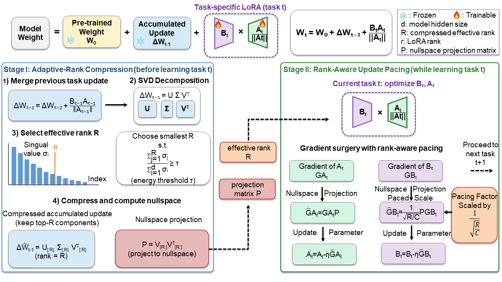

# PaLoRA: Paced Low-Rank Adaptation for Continual Learning

This repository contains the official implementation of our NeurIPS 2026 paper:

**PaLoRA: Paced Low-Rank Adaptation for Continual Learning**
Yuxuan Li, Fanhu Zeng, Hao Tang
**NeurIPS 2026** | [Paper](https://arxiv.org/abs/2610.04226)

<p align="center">    </p>

## Requirements

The code is implemented in PyTorch. Our experiments were conducted with the following environment:

- Python 3.11.4
- PyTorch 2.0.1
- torchvision 0.15.2
- timm 0.6.7

The code has been tested on Linux with an NVIDIA RTX 4080 SUPER GPU.

If you encounter errors such as:

```
RuntimeError: No HIP GPUs are available
```

or

```
ImportError: libtinfo.so.5: cannot open shared object file: No such file or directory
```

you may need to install a PyTorch version compatible with your CUDA environment.

For example, if your system only supports CUDA 11.1, you may install the corresponding PyTorch packages with:

```
pip install torch==1.9.0+cu111 torchvision==0.10.0+cu111 torchaudio==0.9.0 -f https://download.pytorch.org/whl/torch_stable.html
```

If you encounter the following error:

```
TypeError: 'PretrainedCfg' object is not subscriptable
```

please install a compatible version of `timm`, such as:

```
pip install timm==0.6.7
```

## Dataset Preparation

Create a `data/` directory in the project root:

```
mkdir data
```

Then prepare the datasets as follows:

- **CIFAR-100**: The dataset will be downloaded automatically.
- **ImageNet-R**: Download it from [here](https://people.eecs.berkeley.edu/~hendrycks/imagenet-r.tar). After extracting the archive, place the dataset under the `data/` directory.
- **ImageNet-A**: Download it from [here](https://entuedu-my.sharepoint.com/:u:/g/personal/n2207876b_e_ntu_edu_sg/ERYi36eg9b1KkfEplgFTW3gBg1otwWwkQPSml0igWBC46A?e=NiTUkL). After extracting the archive, place the dataset under the `data/` directory.

The resulting directory structure should look similar to:

```
data/
├── imagenet-r/
└── imagenet-a/
```

## Reproducing the Experiments

The configuration files under `configs/palora/` contain the settings used in our experiments.

### CIFAR-100: 10 Tasks

```
python main.py --config configs/palora/c10_palora.json
```

### ImageNet-R: 20 Tasks

```
python main.py --config configs/palora/ir20_palora.json
```

### ImageNet-A: 50 Tasks

```
python main.py --config configs/palora/ia50_palora.json
```

## Acknowledgements

Our implementation is built upon the following excellent open-source projects. We sincerely thank the authors for making their code publicly available:

- [LoRA-Sub-DRS](https://github.com/scarlet0703/LoRA-Sub-DRS/)
- [InfLoRA](https://github.com/liangyanshuo/InfLoRA)

## Citation

If you find this work useful for your research, please consider citing our paper:

```
@misc{li2026palorapacedlowrankadaptation,
  title        = {PaLoRA: Paced Low-Rank Adaptation for Continual Learning},
  author       = {Yuxuan Li and Fanhu Zeng and Hao Tang},
  year         = {2026},
  eprint       = {2610.04226},
  archivePrefix = {arXiv},
  primaryClass = {cs.LG},
  url          = {https://arxiv.org/abs/2610.04226}
}
```
